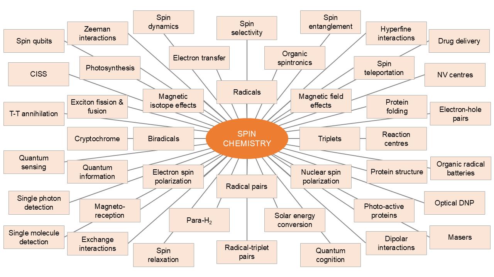

<!-- Google tag (gtag.js) -->

- Table of Contents
{:toc .large-only}

# About

<!--author-->

## What is spin chemistry?

{:.tail width="1000" height="500" loading="lazy"}

Broadly defined, Spin Chemistry deals with the effects of electron and nuclear spins in particular, and magnetic interactions in general, on the rates and yields of chemical reactions.
Over the years, numerous areas of science have been influenced by spin chemistry, such areas are summarised below.

{:.tail width="1000" height="500" loading="lazy"}

For more information, please visit [here](https://en.wikipedia.org/wiki/Spin_chemistry).

## Join us

Please join our [Discord server](https://discord.gg/NZdjhFS3Es) to ask questions and discuss topics with people from the field of spin chemistry.

 

    <table border='5'>
     <tr><td>
      <table border='0' bgcolor="#e7e7e7">
       <tr>
        <td >
        
       </td>

       <td style="text-align:center;  width: 400px">
         <form action="https://spinchemistrycommunity.pythonanywhere.com/spinchemistrycommunity_signup" method="POST">
          Sign up with your email for the latest publications and job vacancies:
               <input type="email" name="email_address">
               <input type="hidden" name="signup_page" value="https://spinchemistrycommunity.pythonanywhere.com/static/thanks.html" /> <!--value="http://spin-chemistry-community.github.io/"-->
               <input type="submit" value="Sign up">
                Thanks for your interest in the Spin Chemistry Community.

           </form>
       </td>
            <td align='right'>
                
           </td>
      </tr>
      </table>
     </td></tr>
    </table>
    

	
	

Website created and maintained by Lewis M Antill. Please [email](mailto:lewismantill@gmail.com) items for inclusion on this website.
