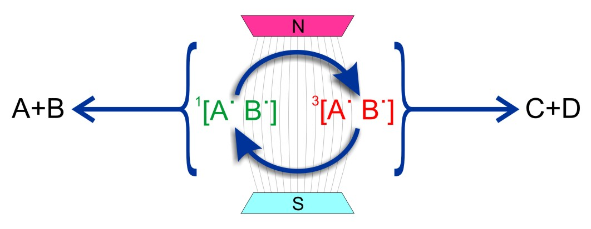

# About

<!--author-->

## What is spin chemistry?

{:.tail width="1000" height="500" loading="lazy"}

Broadly defined, Spin Chemistry deals with the effects of 
electron and nuclear spins in particular, and magnetic 
interactions in general, on the rates and yields of chemical 
reactions. It is manifested as spin polarization in EPR and 
NMR spectra and the magnetic field dependence of chemical 
processes. Applications include studies of the mechanisms 
and kinetics of free radical and biradical reactions in 
solution, the energetics of photosynthetic electron transfer 
reactions, and various magnetokinetic effects, including 
possible biological effects of extremely low frequency 
and radiofrequency electromagnetic fields, the mechanisms 
by which animals can sense the Earth’s magnetic field for 
orientation and navigation, and the possibility of 
manipulating radical lifetimes so as to control the 
outcome of their reactions.

## Join us

You can join our [Discord server](https://discord.io/spin-chemistry-community/)

 

    <table border='5'>
     <tr><td>
      <table border='0' bgcolor="#e7e7e7">
       <tr>
        <td >
        
       </td>

       <td style="text-align:center;  width: 400px">
         <form action="https://spinchemistrycommunity.pythonanywhere.com/spinchemistrycommunity_signup" method="POST">
          Hi, sign up for the latest publications and job vacancies:
               <input type="email" name="email_address">
               <input type="hidden" name="signup_page" value="https://spinchemistrycommunity.pythonanywhere.com/static/thanks.html" /> <!--value="http://spin-chemistry-community.github.io/"-->
               <input type="submit" value="Sign up">
                Thanks for your interest in the Spin Chemistry Community

           </form>
       </td>
            <td align='right'>
                
           </td>
      </tr>
      </table>
     </td></tr>
    </table>
    

	
	

Please email [Lewis M Antill](mailto:lewismantill@gmail.com) items for inclusion on this website.
