# International Spin Chemistry Committee

## Jan Behrends (Berlin, Germany) 

[Research Group](https://www.physik.fu-berlin.de/en/einrichtungen/ag/ag-behrends/mitarbeiter/behrends/index.html)

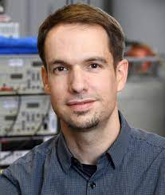{:.tail width="250" height="300" loading="lazy"}

## Christoph Boehme (Salt Lake City, USA) 

[Research Group](https://web.physics.utah.edu/~boehmelab/)

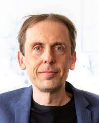{:.tail width="250" height="300" loading="lazy"}

## Silvia Cavagnero (Madison, USA) 

[Research Group](https://cavagnero.chem.wisc.edu/)

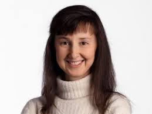{:.tail width="250" height="300" loading="lazy"}

## Matvey Fedin (Novosibirsk, Russia)

[Research Group](https://www.tomo.nsc.ru/homepages/LMR/Fedin/)

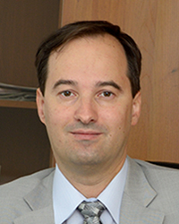{:.tail width="200" height="300" loading="lazy"}

## Malcolm Forbes (Bowling Green, USA)

[Research Group](https://www.bgsu.edu/arts-and-sciences/chemistry/faculty/malcolm-forbes.html)

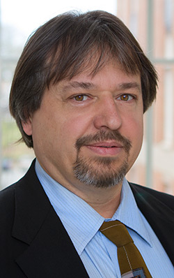{:.tail width="200" height="300" loading="lazy"}

## Peter Hore, Chairman (Oxford, UK)

[Research Group](http://hore.chem.ox.ac.uk/index.shtml)

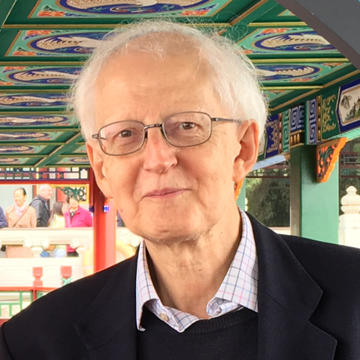{:.tail width="200" height="300" loading="lazy"}

## Yasuhiro Kobori (Kobe, Japan)

[Research Group](http://www2.kobe-u.ac.jp/~ykobori/frame.html)

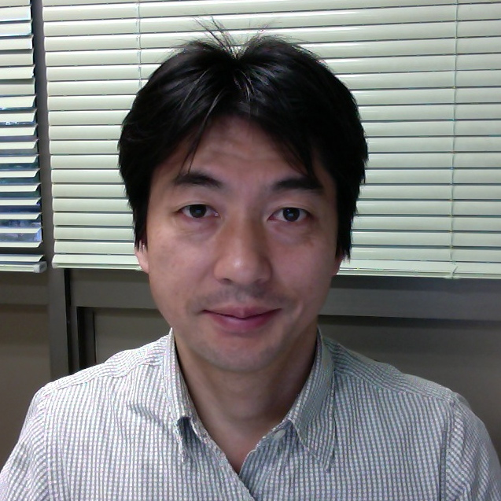{:.tail width="200" height="300" loading="lazy"}

## Leonid Kulik (Novosibirsk, Russia)

[ResearchGate](https://www.researchgate.net/profile/Leonid-Kulik)

{:.tail width="200" height="300" loading="lazy"}

## Dane McCamey (Sydney, Australia)

[Research Group](https://research.unsw.edu.au/people/professor-dane-mccamey)

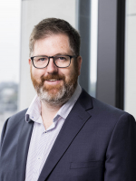{:.tail width="200" height="300" loading="lazy"}

## Jörg Matysik (Leipzig, Germany)

[Research Group](https://www.cidnp.net/)

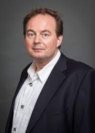{:.tail width="200" height="300" loading="lazy"}

## Kiminori Maeda (Saitama, Japan)

[Research Group](http://park.saitama-u.ac.jp/~maedalab/home.html)

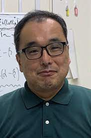{:.tail width="200" height="300" loading="lazy"}

## Ron Naaman (Rehovot, Israel)

[Research Group](https://www.weizmann.ac.il/chembiophys/naaman/home)

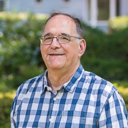{:.tail width="200" height="300" loading="lazy"}

## Christiane Timmel (Oxford, UK)

[Research Group](http://timmel.chem.ox.ac.uk/)

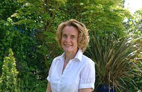{:.tail width="200" height="300" loading="lazy"}

## Marilena di Valentin (Padua, Italy)

[Research Group](https://wwwdisc.chimica.unipd.it/eprlab/index.php/marilena-di-valentin/)

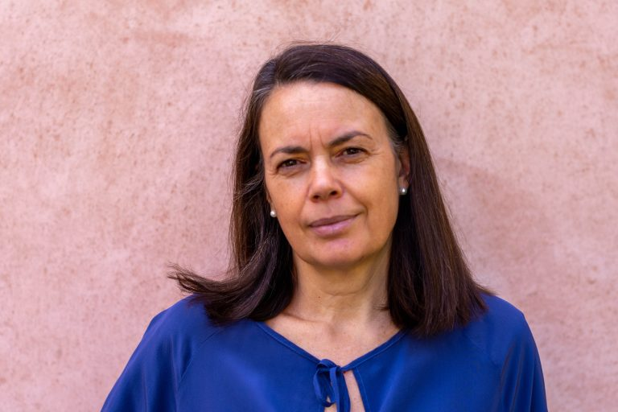{:.tail width="200" height="300" loading="lazy"}

## Michael Wasielewski (Evanston, USA)

[Research Group](https://sites.northwestern.edu/wasielewski/)

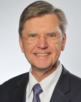{:.tail width="200" height="300" loading="lazy"}

## Stefan Weber (Freiburg, Germany)

[Research Group](https://www.radicals.uni-freiburg.de/de/ak/weber)

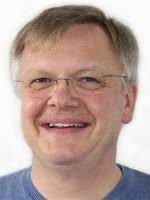{:.tail width="200" height="300" loading="lazy"}
