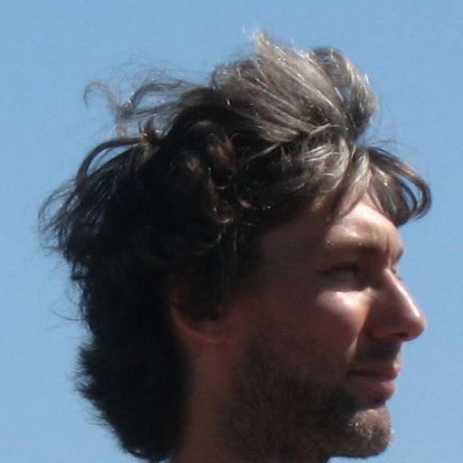

# International Spin Chemistry Committee

## Jan Behrends (Berlin, Germany) 

[Research Group](https://www.physik.fu-berlin.de/en/einrichtungen/ag/ag-behrends/mitarbeiter/behrends/index.html)

{:.tail width="200" height="300" loading="lazy"}

## Christoph Boehme (Salt Lake City, USA) 

[Research Group](https://web.physics.utah.edu/~boehmelab/)

{:.tail width="200" height="300" loading="lazy"}

## Silvia Cavagnero (Madison, USA) 

[Research Group](https://cavagnero.chem.wisc.edu/)

{:.tail width="300" height="400" loading="lazy"}

## Matvey Fedin (Novosibirsk, Russia)

[Research Group](https://www.tomo.nsc.ru/homepages/LMR/Fedin/)

{:.tail width="200" height="300" loading="lazy"}

## Malcolm D E Forbes (Bowling Green, USA)

[Research Group](https://www.bgsu.edu/arts-and-sciences/chemistry/faculty/malcolm-forbes.html)

{:.tail width="200" height="300" loading="lazy"}

## Peter J Hore, Chairman (Oxford, UK)

[Research Group](http://hore.chem.ox.ac.uk/index.shtml)

{:.tail width="200" height="300" loading="lazy"}

## Yasuhiro Kobori (Kobe, Japan)

[Research Group](http://www2.kobe-u.ac.jp/~ykobori/frame.html)

{:.tail width="200" height="300" loading="lazy"}

## Leonid Kulik (Novosibirsk, Russia)

[ResearchGate](https://www.researchgate.net/profile/Leonid-Kulik)

{:.tail width="200" height="300" loading="lazy"}

## Dane McCamey (Sydney, Australia)

[Research Group](https://research.unsw.edu.au/people/professor-dane-mccamey)

{:.tail width="200" height="300" loading="lazy"}

## Jörg Matysik (Leipzig, Germany)

[Research Group](https://www.cidnp.net/)

{:.tail width="200" height="300" loading="lazy"}

## Kiminori Maeda (Saitama, Japan)

[Research Group](http://park.saitama-u.ac.jp/~maedalab/home.html)

{:.tail width="200" height="300" loading="lazy"}

## Ron Naaman (Rehovot, Israel)

[Research Group](https://www.weizmann.ac.il/chembiophys/naaman/home)

{:.tail width="200" height="300" loading="lazy"}

## Christiane Timmel (Oxford, UK)

[Research Group](http://timmel.chem.ox.ac.uk/)

{:.tail width="300" height="400" loading="lazy"}

## Marilena di Valentin (Padua, Italy)

[Research Group](https://wwwdisc.chimica.unipd.it/eprlab/index.php/marilena-di-valentin/)

{:.tail width="300" height="400" loading="lazy"}

## Michael Wasielewski (Evanston, USA)

[Research Group](https://sites.northwestern.edu/wasielewski/)

{:.tail width="200" height="300" loading="lazy"}

## Stefan Weber (Freiburg, Germany)

[Research Group](https://www.radicals.uni-freiburg.de/de/ak/weber)

{:.tail width="200" height="300" loading="lazy"}

## Previous committee members

Frank J Adrian (Olney, USA)

Elena G Bagryanskaya (Novosibirsk, Russia)

Samita Basu (Kolkata, India)

Klaus-Peter Dinse (Darmstadt, Germany)

Sergei A Dzuba (Novosibirsk, Russia)

Art van der Est (St. Catharines, Canada)

Günter Grampp (Graz, Austria)

Y.John I'Haya, Founder Chairman (Tokyo, Japan)

Hisaharu Hayashi (Wako, Japan)

Arnold Hoff (Leiden, Netherlands)

Konstantin Ivanov (Novosibirsk, Russia)

Gerd Kothe (Freiburg, Germany)

Haim Levanon (Jerusalem, Israel)

Keith A Mclauchlan (Oxford, UK)

Yuri N Molin (Novosibirsk, Russia)

Hisao Murai (Shizuoka, Japan)

James R Norris (Chicago, USA)

Henning Paul (Zürich, Switzerland)

Ulrich E Steiner, Chairman (Konstanz, Germany)

Renad Z Sagdeev (Novosibirsk, Russia)

Yoshifumi Tanimoto (Hiroshima, Japan)

Shozo Tero-Kubota (Sendai, Japan)

Daniel P Weitekamp (Pasadena, USA)

Markus Wohlgenannt (Iowa City, USA)

Seigo Yamauchi (Sendai, Japan)

