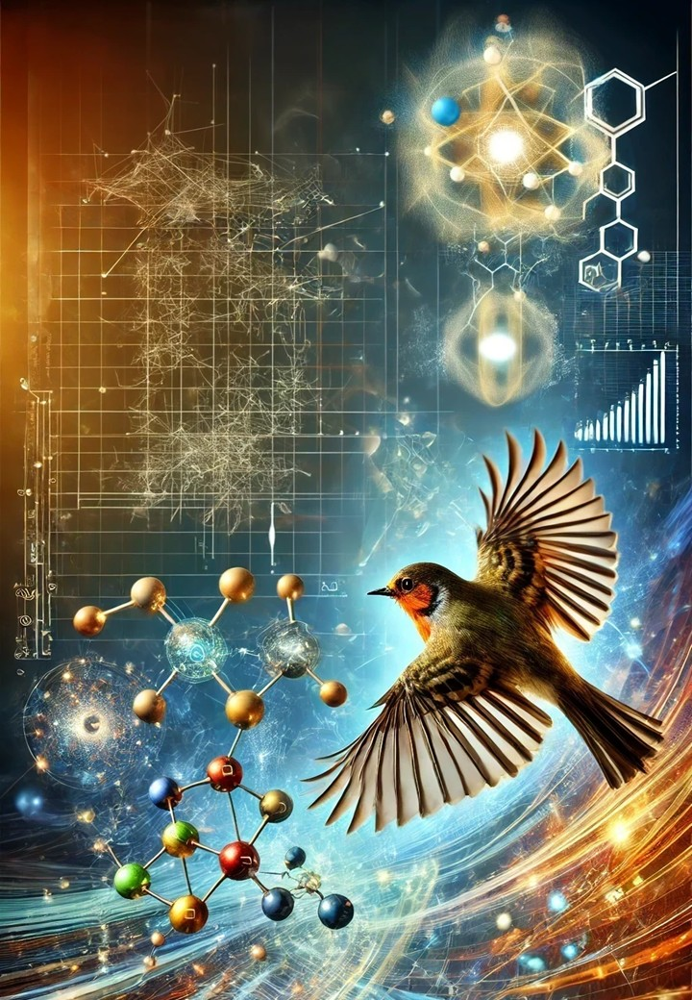

<!-- Google tag (gtag.js) -->

- Table of Contents
{:toc .large-only}

# Spin Chemistry Graduate Seminar Series

The aim of this series is to provide the opportunity for graduate students to present their research, improve their presentation skills, practice presenting in English (if English is not your first language), and to gain further experience in discussing their work with researchers outside of their group. 

We would like to invite graduate students to participate in the series by giving a 20 min presentation (+10 min Q&A).

3rd Wednesday of the month

Meeting is held [here](https://riken-jp.zoom.us/j/96309792382?pwd=9rbcZYgA7yfRPINS2MSsEXkoUQq9aJ.1)

07:00 PST | 10:00 EST | 14:00 GMT | 16:00 CET | 22:00 CST | 23:00 KST

If you would like to give a talk or require further information, please contact Lewis M. Antill (lewismantill@gmail.com)

{:.tail width="400" height="600" loading="lazy"}

## Ana Štuhec (University of Oxford, UK) - January 15th, 2025

A quantum inclination compass - elucidating the inner workings of avian magnetoreception with confocal microscopy

## Qiuhong Luo (Beijing Institute of Technology, China) - February 19th, 2025

Coupling between paramagnetic ion spins and an electromagnetic mode within ruby with a filling factor of unity

## Philip Benjamin (University of Oxford, UK) - March 19, 2025

Dynamic spin interactions could enhance magnetic compass sensitivity in cryptochrome radical pairs

## Damyan Frantzov (University of Oxford, UK) - April 16th, 2025

Spectroscopic studies on a molecular compass: new perspectives

## Pedro Alvarez (Carl von-Ossietzky University of Oldenburg, Germany) - May 21st, 2025

Simulation of RYDMR experiment with MolSpin

## Daniel Cubbin (University of Oxford, UK) - June 18th, 2025

Investigating avian cryptochromes: from microseconds to minutes

## Ummay Mahfuza Shapla (University of Wisconsin-Madison, USA) - July 16th, 2025

Stereoselective synthesis of an L-tyrosine quasi-isolated spin-pair isotopologs and applications to LED-enhanced NMR hyperpolarization

## Anubhab Halder (University of Wisconsin-Madison, USA) - August 20th, 2025

Sensitivity enhancement in biomolecular NMR at low-magnetic field via LC-Photo-CIDNP

## Andre Nogueira (North Carolina State University, USA) - September 17th, 2025

Photoinduced electron spin polarization of stable radicals using ligand-to-ligand charge transfer chromophores

## Minna Zhang (Beijing Institute of Technology, China) - October 15th, 2025

Towards lasing-enhanced quantum sensing with organic molecular spins

## Wataru Ishii (The University of Tokyo, Japan) - November 19th, 2025

Room temperature coherent spin control of quintet multiexcitons in optically addressable macrocyclic parallel dimers

