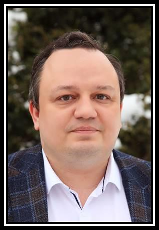

- Table of Contents
{:toc .large-only}

# In Memoriam

## Konstantin (Kostya) L Ivanov

10 January 1977 – 05 March 2021

{:.tail width="200" height="300" loading="lazy"}

[In memoriam Konstantin L'vovich Ivanov](https://mr.copernicus.org/articles/2/341/2021/)

[The Third Konstantin Ivanov Intercontinental Magnetic Resonance Conference on Methods and Applications ICONS-3](https://link.springer.com/article/10.1007/s00723-021-01441-z)

## Arnold J Hoff

30 April 1939 - 22 April 2002

{:.tail width="200" height="300" loading="lazy"}

[Structure-Mechanism in Photosynthesis: Dedicated to the Memory of Professor Arnold Jan Hoff](https://www.sciencedirect.com/journal/chemical-physics/vol/294/issue/3)

