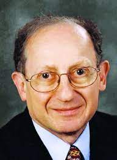
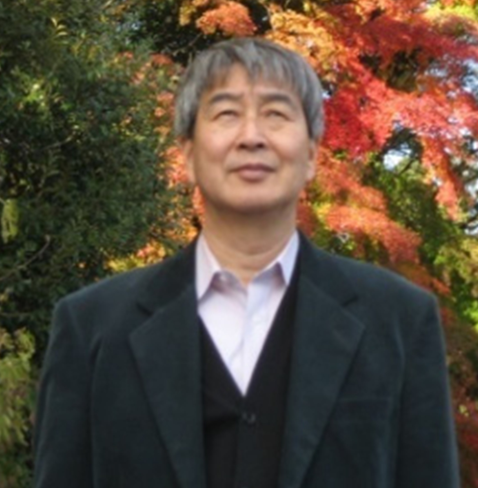
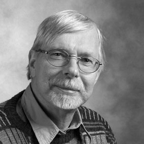

<!-- Google tag (gtag.js) -->

- Table of Contents
{:toc .large-only}

# In Memoriam

## Konstantin (Kostya) L Ivanov

10 January 1977 – 05 March 2021

{:.tail width="200" height="300" loading="lazy"}

[In memoriam Konstantin L'vovich Ivanov](https://mr.copernicus.org/articles/2/341/2021/)

[The Third Konstantin Ivanov Intercontinental Magnetic Resonance Conference on Methods and Applications ICONS-3](https://link.springer.com/article/10.1007/s00723-021-01441-z)

## Nicholas J Turro

18 May 1938 – 24 November 2012

{:.tail width="200" height="300" loading="lazy"}

[In Memoriam...Nicholas J. Turro](http://www.columbia.edu/cu/chemistry/misc-pages/prof_turro.html)

[Angewandte Chemie](https://onlinelibrary.wiley.com/doi/full/10.1002/anie.201209993)

[The New York Times](https://www.legacy.com/us/obituaries/nytimes/name/nicholas-turro-obituary?id=24353901)

[Photochemistry and Photobiology](https://onlinelibrary.wiley.com/doi/10.1111/php.12221)

[Photochemical & Photobiological Sciences - The Turro Legacy](https://pubs.rsc.org/en/journals/journalissues/pp#!issueid=pp013002&type=archive&issnprint=1474-905x)

[A tribute to Nicholas J. Turro — An icon of modern molecular photochemistry](https://www.sciencedirect.com/science/article/pii/S101060301300405X?via%3Dihub)

## Seigo Yamauchi

1948 – 26 September 2012

{:.tail width="200" height="300" loading="lazy"}

[In Memory of Seigo Yamauchi](chrome-extension://efaidnbmnnnibpcajpcglclefindmkaj/https://ieprs.org/wp-content/uploads/2020/06/Vol22_4.pdf)

## Arnold J Hoff

30 April 1939 - 22 April 2002

{:.tail width="200" height="300" loading="lazy"}

[Structure-Mechanism in Photosynthesis: Dedicated to the Memory of Professor Arnold Jan Hoff](https://www.sciencedirect.com/journal/chemical-physics/vol/294/issue/3)

