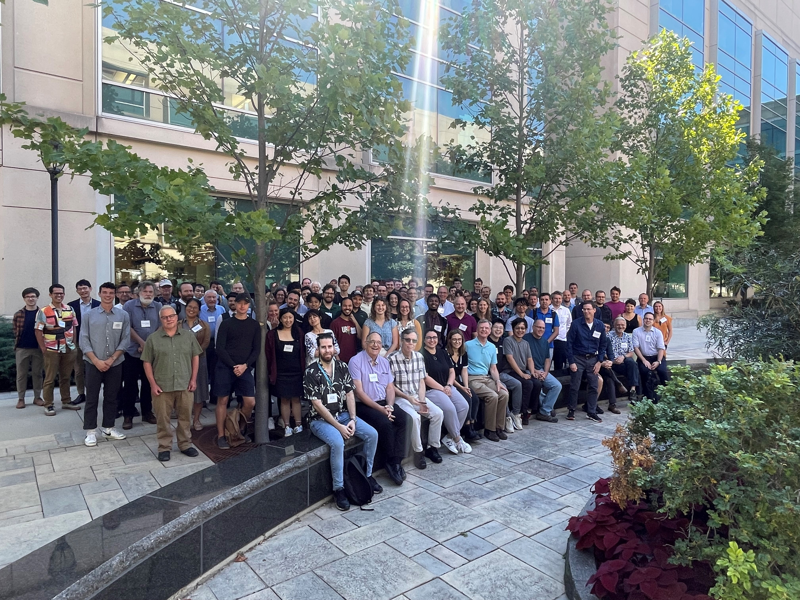

# Spin Chemistry Meetings

The inaugural Spin Chemistry Meeting, organised by the founder chairman of the 
International Spin Chemistry Committee, Professor Y. John I’Haya, was held in 
Tomakomai, Hokkaido, Japan in 1991. Since then, meetings have taken place more-or-less biennially.

## 2024 - Kobe, Japan

[Join here](https://sites.google.com/gsuite.kobe-u.ac.jp/scm2024/home?authuser=0)

## 2022 - Evanston, USA

{:.tail width="500" height="500" loading="lazy"}

## 2019 - St Petersburg, Russia

## 2017 - Schluchsee, Germany

## 2015 - Kolkata, India

## 2013 - Bad Hofgastein, Austria

## 2011 - Noordwijk, The Netherlands

## 2009 - St Catharines, Canada

## 2007 - San Servolo, Italy

## 2005 - Oxford, UK

## 2003 - Chapel Hill, USA

## 2001 - Tokyo, Japan

## 1999 - Emmetten, Switzerland

## 1997 - Jerusalem, Israel

## 1996 - Novosibirsk, Russia

## 1994 - Chicago, USA

## 1992 - Konstanz, Germany

## 1991 - Tomakomai, Japan
