<!-- Google tag (gtag.js) -->

- Table of Contents
{:toc .large-only}

# Spin Chemistry Meetings

The inaugural Spin Chemistry Meeting, organised by the founder chairman of the 
International Spin Chemistry Committee, Professor Y. John I’Haya, was held in 
Tomakomai, Hokkaido, Japan in 1991. Since then, meetings have taken place more-or-less biennially.

Collected abstracts of the Spin Chemistry Meetings, 1991-2019 were provided by 
[Prof. Ulrich Steiner](mailto:ulrich.steiner@uni-konstanz.de), University of Konstanz.

## 2028 - Leipzig, Germany

Coming soon!

## 2026 - Padua, Italy

Coming soon!

## 2024 - Kobe, Japan

[Book of Abstracts](meetings/SCM_2024_abstracts.pdf)

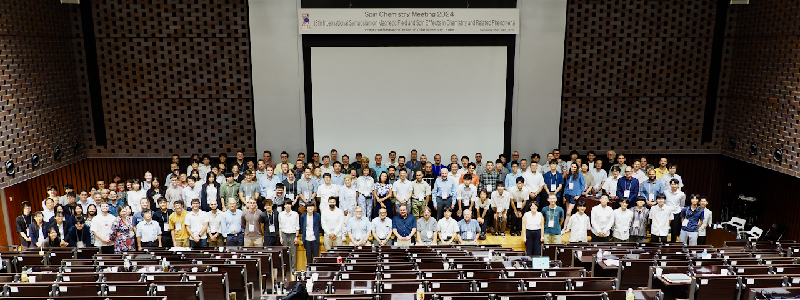{:.tail width="500" height="500" loading="lazy"}

## 2022 - Evanston, USA

[Book of Abstracts](meetings/SCM_2022_abstracts.pdf)

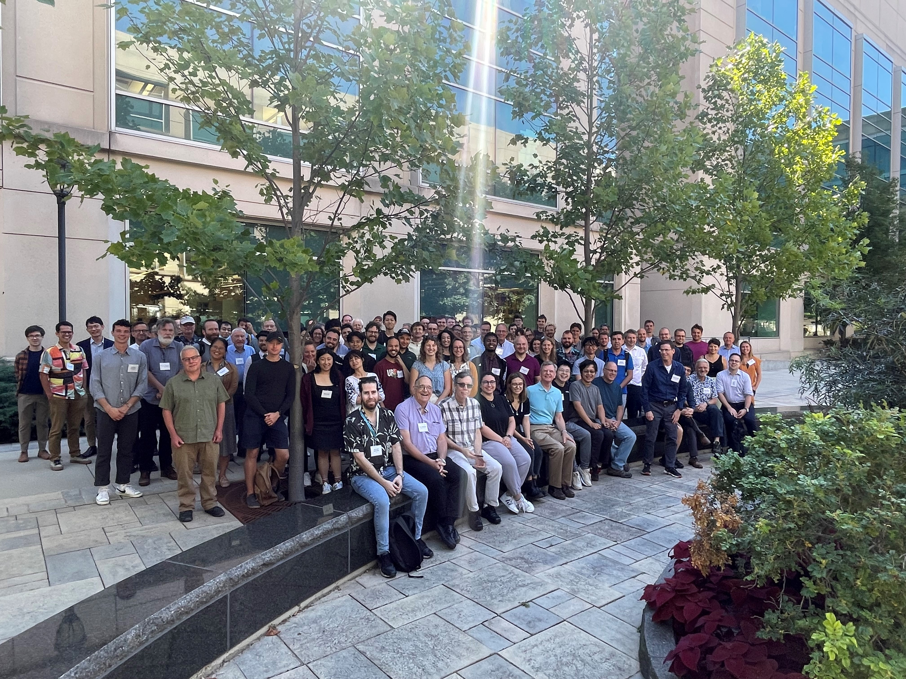{:.tail width="500" height="500" loading="lazy"}

## 2019 - St Petersburg, Russia

[Book of Abstracts](meetings/SCM_2019_abstracts.pdf)

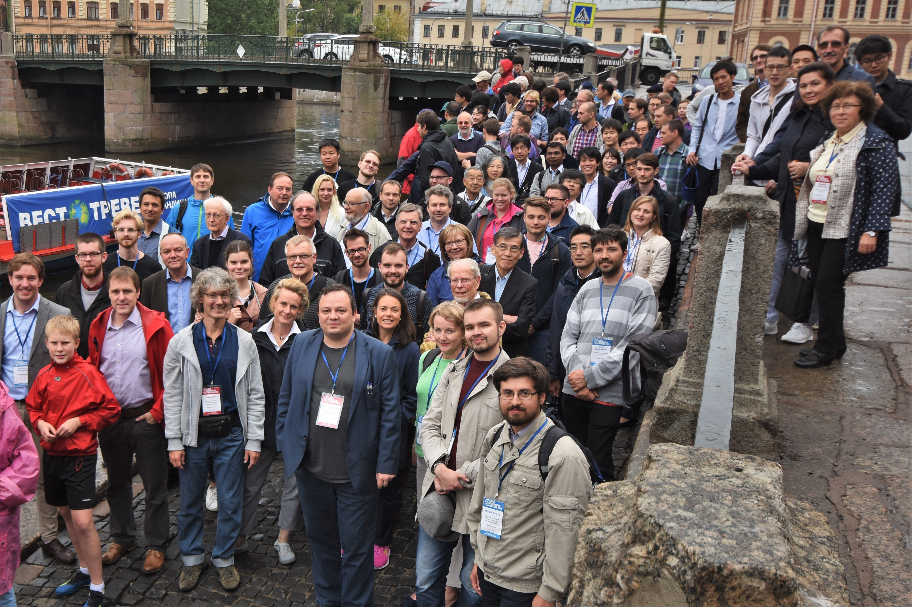{:.tail width="500" height="500" loading="lazy"}

## 2017 - Schluchsee, Germany

[Book of Abstracts](meetings/SCM_2017_abstracts.pdf)

{:.tail width="500" height="500" loading="lazy"}

## 2015 - Kolkata, India

[Book of Abstracts](meetings/SCM_2015_abstracts.pdf)

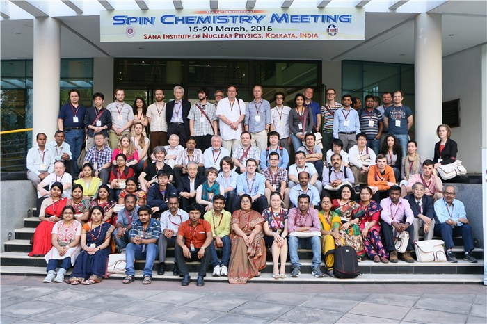{:.tail width="500" height="500" loading="lazy"}

## 2013 - Bad Hofgastein, Austria

[Book of Abstracts](meetings/SCM_2013_abstracts.pdf)

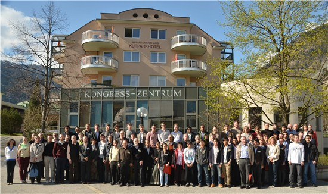{:.tail width="500" height="500" loading="lazy"}

## 2011 - Noordwijk, The Netherlands

[Book of Abstracts](meetings/SCM_2011_abstracts.pdf)

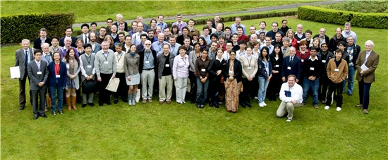{:.tail width="500" height="500" loading="lazy"}

## 2009 - St Catharines, Canada

[Book of Abstracts](meetings/SCM_2009_abstracts.pdf)

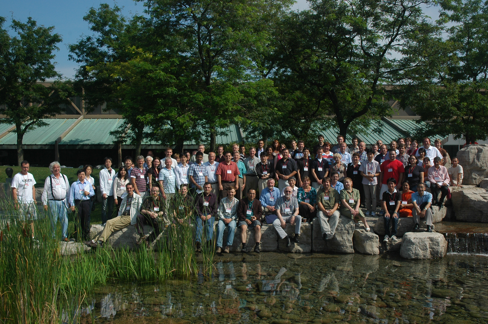{:.tail width="500" height="500" loading="lazy"}

## 2007 - San Servolo, Italy

[Book of Abstracts](meetings/SCM_2007_abstracts.pdf)

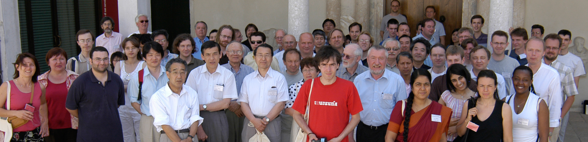{:.tail width="500" height="500" loading="lazy"}

## 2005 - Oxford, UK

[Book of Abstracts](meetings/SCM_2005_abstracts.pdf)

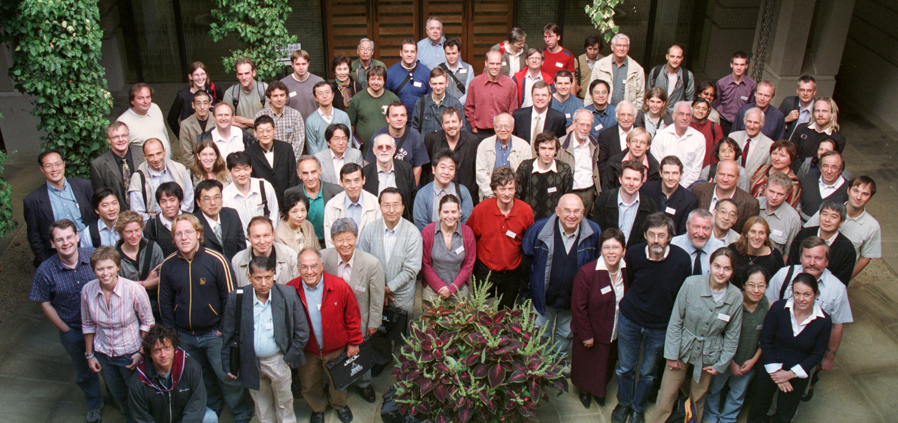{:.tail width="500" height="500" loading="lazy"}

## 2003 - Chapel Hill, USA

[Book of Abstracts](meetings/SCM_2003_abstracts.pdf)

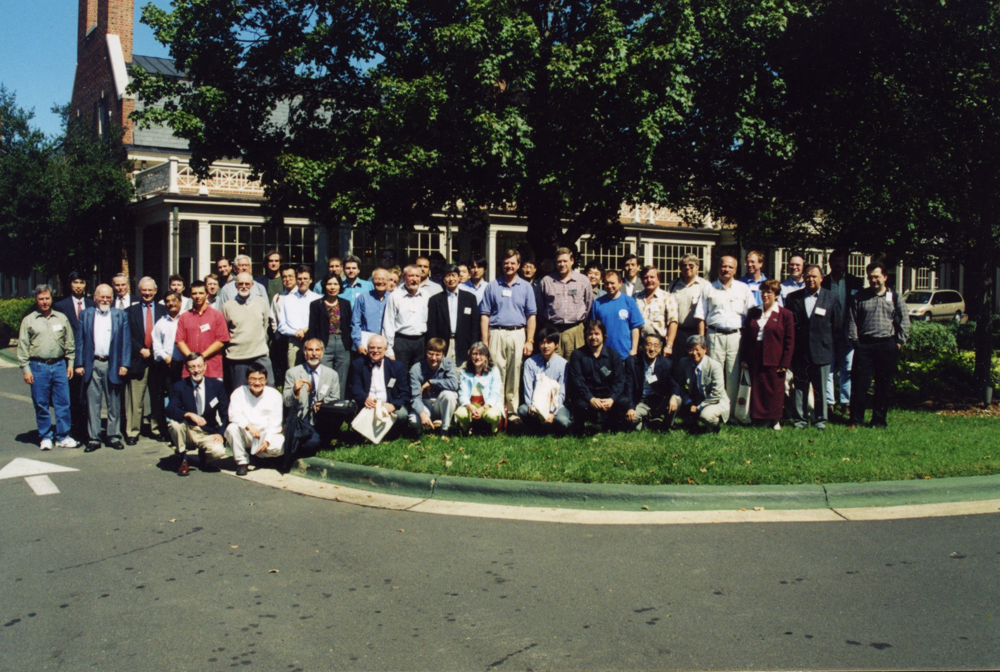{:.tail width="500" height="500" loading="lazy"}

## 2001 - Tokyo, Japan

[Book of Abstracts](meetings/SCM_2001_abstracts.pdf)

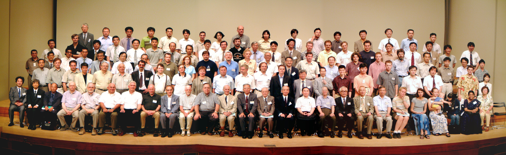{:.tail width="500" height="500" loading="lazy"}

## 1999 - Emmetten, Switzerland

[Book of Abstracts](meetings/SCM_1999_abstracts.pdf)

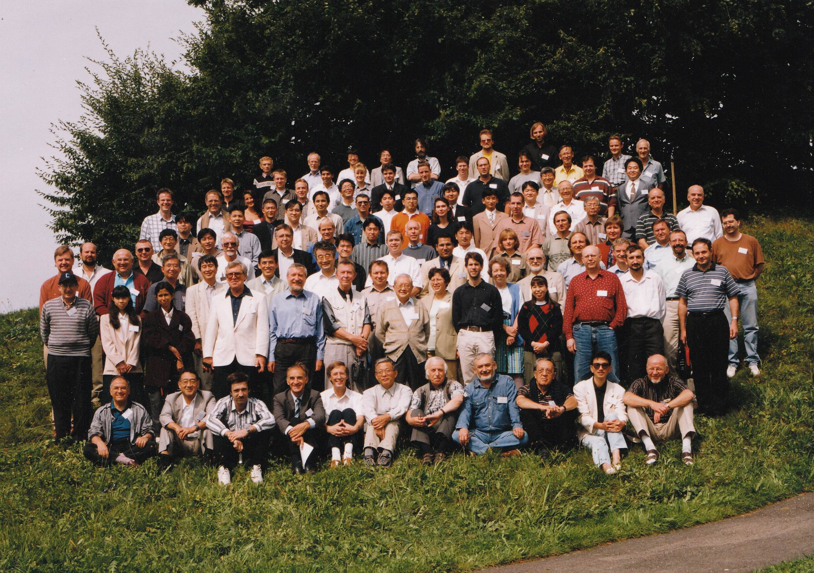{:.tail width="500" height="500" loading="lazy"}

## 1997 - Jerusalem, Israel

[Book of Abstracts](meetings/SCM_1997_abstracts.pdf)

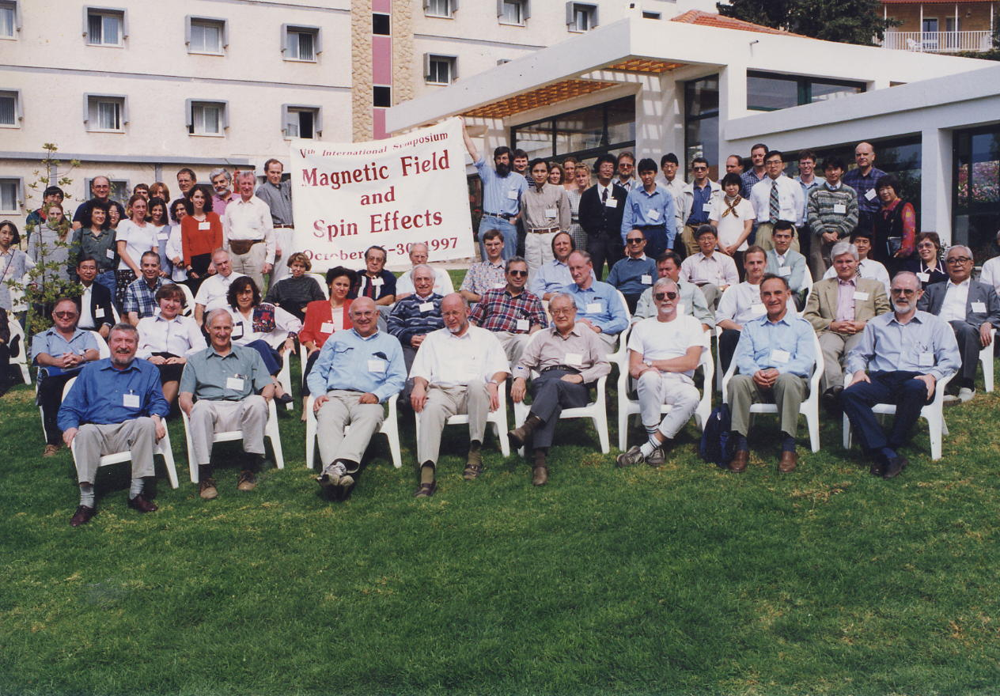{:.tail width="500" height="500" loading="lazy"}

## 1996 - Novosibirsk, Russia

[Book of Abstracts](meetings/SCM_1996_abstracts.pdf)

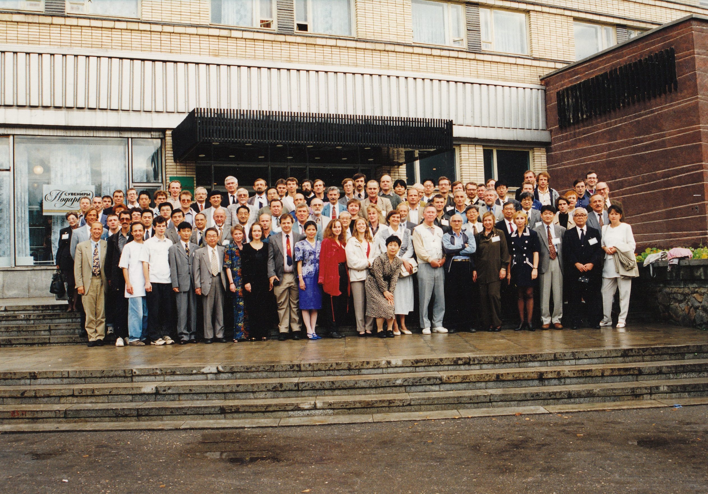{:.tail width="500" height="500" loading="lazy"}

## 1994 - Chicago, USA

[Book of Abstracts](meetings/SCM_1994_abstracts.pdf)

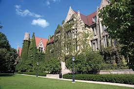{:.tail width="500" height="500" loading="lazy"}

## 1992 - Konstanz, Germany

[Book of Abstracts](meetings/SCM_1992_abstracts.pdf)

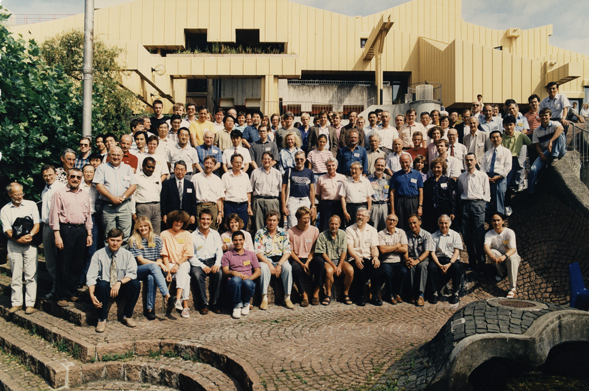{:.tail width="500" height="500" loading="lazy"}

## 1991 - Tomakomai, Japan

[Book of Abstracts](meetings/SCM_1991_abstracts.pdf)

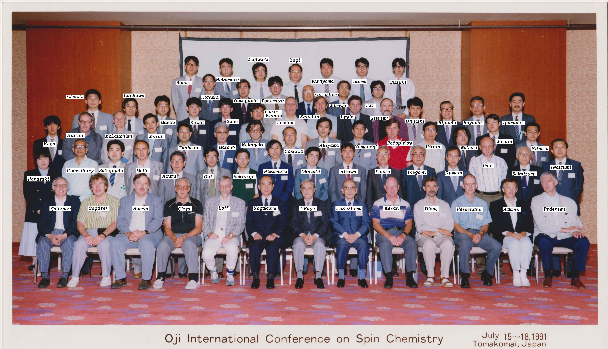{:.tail width="500" height="500" loading="lazy"}
